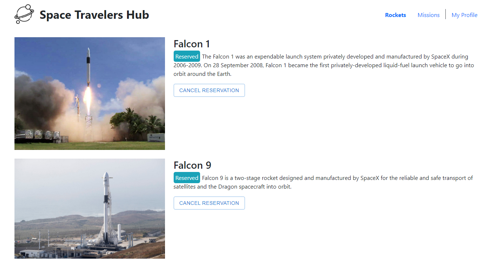
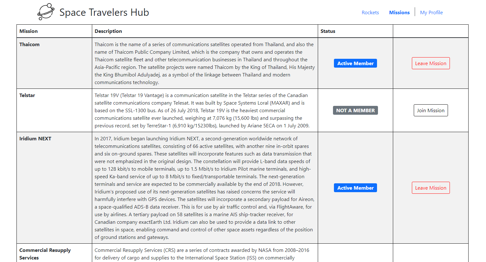
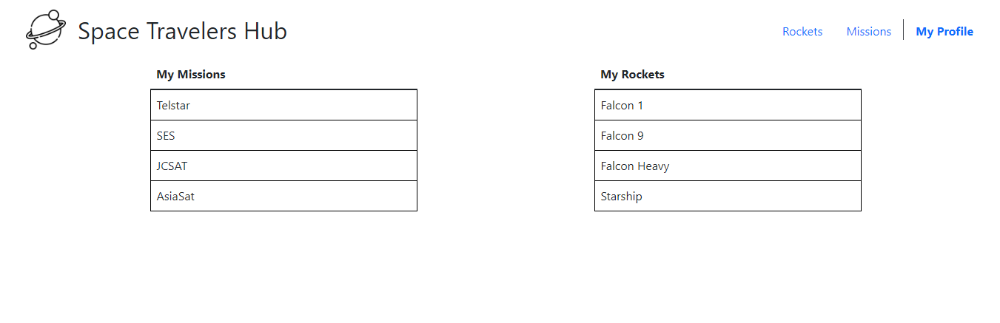

# Space Travelers Hub

> Display missions and rockets, attend or leave missions, also available to make reservations on rockets.



> Display Rockets from API and make reservations



> Display Missions from API and make reservations



> Display profile info


## 👷🏻 Built using
    - React
    - JavaScript
    - Redux
    - VSCode
    - GIT
    - Github
    - CSS
    - Bootstrap
    - Linters
  
## 🌐 Live Preview

> [Space Travellers Hub](https://space-travellers.netlify.app/)

## 🚩 Getting Started

To get a local copy up and running follow these simple example steps.

### ✅ Prerequisites

* Make sure that **Node JS** is installed in your computer (try to run _npm -v_ from your prompt), if not you can install it from [here.](https://nodejs.org/en/download/)


* [Download](https://github.com/peterdgreat/Space-Travellers-Hub/archive/refs/heads/development.zip) and unzip **or** [clone this repository](https://docs.github.com/es/github/creating-cloning-and-archiving-repositories/cloning-a-repository)


### 👨🏻‍🔧 Setup

- Open your terminal and move to the root of the project, using ```$ cd``` command.
- Run ```$ npm install``` to install all dependencies.
- You must run ```$ npm start``` to start live server
- Then your browser will open a local copy

### 🔌 Usage

- You can go to http://127.0.0.1:3000/ to use the app locally

## Authors

### 👨🏻‍💻 Kenny Ortega

- GitHub: [kensayo](https://github.com/kensayo)
- Twitter: [@kensayo](https://twitter.com/kensayo)
- LinkedIn: [LinkedIn](https://www.linkedin.com/in/kennyortega/)
  
### 👨🏿‍💻 Ajayi Peter

- GitHub: [@peterdgreat](https://github.com/peterdgreat)
- Twitter: [@dev_peter_O](https://twitter.com/dev_Peter_O)
- LinkedIn: [ajayipeter](https://www.linkedin.com/in/ajayipeter/)


### 🤝🏻 Contributions and issues are welcome!

License
This project is [MIT](./MIT.md) licensed.
